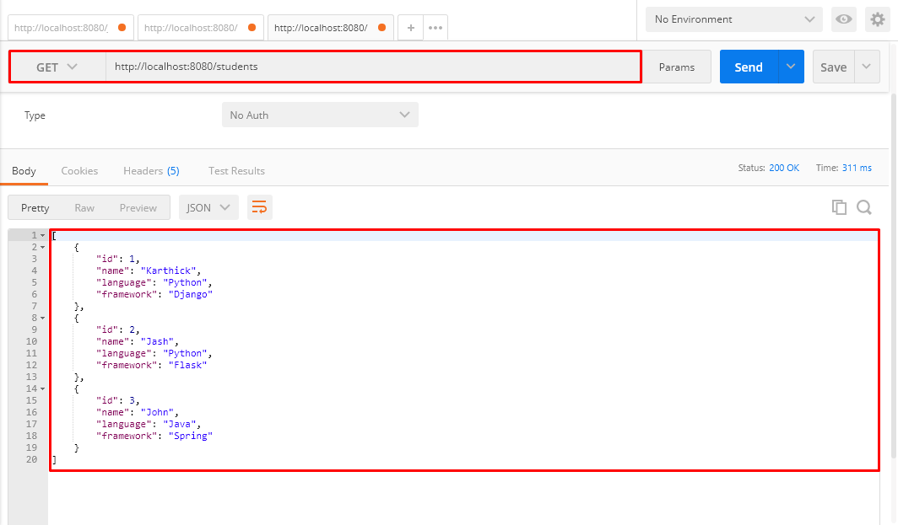
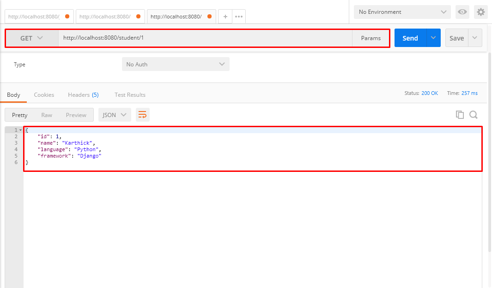
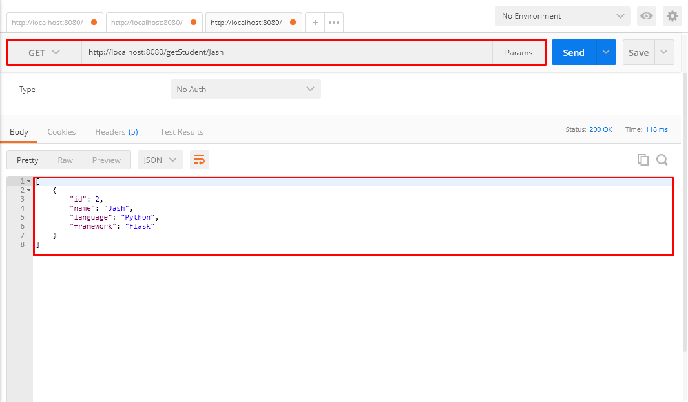
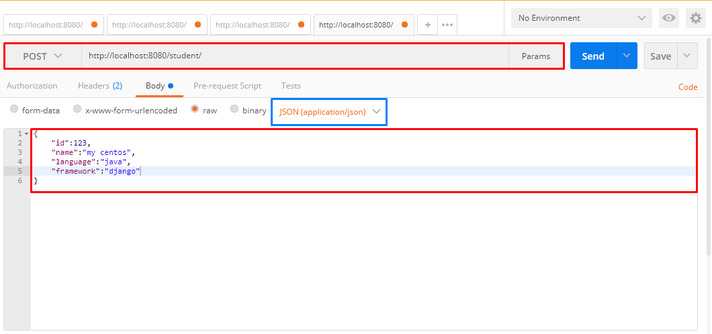
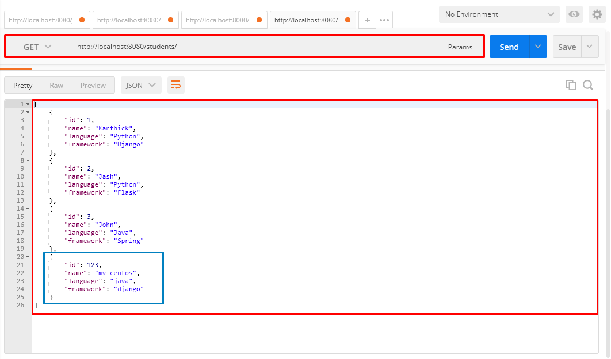
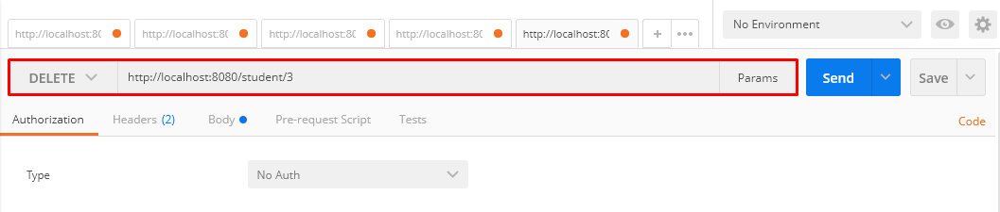
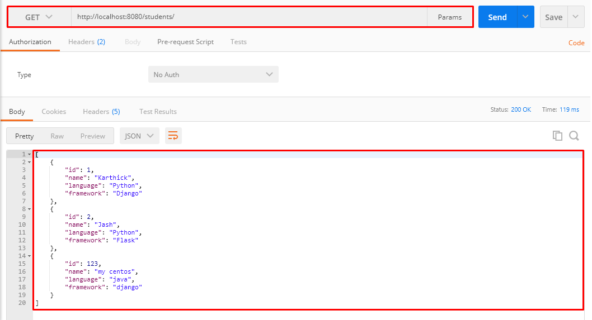

# REST-API-using-Java

The uploaded REST API is to manage a student database, by integrating it with any thirty party applications or sites. It allows the user to create, view and delete a particular student from the database.

# USAGE

# GET - Display all students

The GET operation allows the user to get all the students enrolled in the database. 
Passing the parameter students will display all the students from the database.
The following screenshot is a GET request from POSTMAN(http-client)

# GET - Display student based on ID

This GET operation requires an argument ID to pass through in the URL. So that, it will respond by displaying only the particular student matching the ID.
The following screenshot is a GET request from POSTMAN(http-client)

# GET - Search student based on their name

This GET operation requires an argument name to pass through in the URL. So that, it will respond by displaying only the particular student matching the name.
The following screenshot is a GET request from POSTMAN(http-client)

# POST - Create a new student profile

This POST operation allows the end user to add a new student. It requires a body file for sending a request, which is of APPLICATION/JSON format. 
The following screenshot is a POST request from POSTMAN(http-client)

Now if we display all the students, the user we created using POST method is added to the database.

# DELETE - Removes a student from the database

This Delete operation requires an argument ID, to particularly locate the student that needs to be removed based on the ID. 
The following screenshot is a DELETE request from POSTMAN(http-client)

Now, if we check the database, by getting all the students from the database, The student that we removed is not gonna display in the response.

